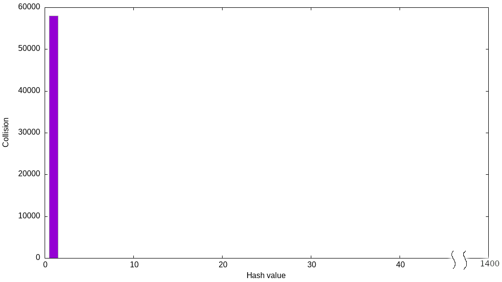
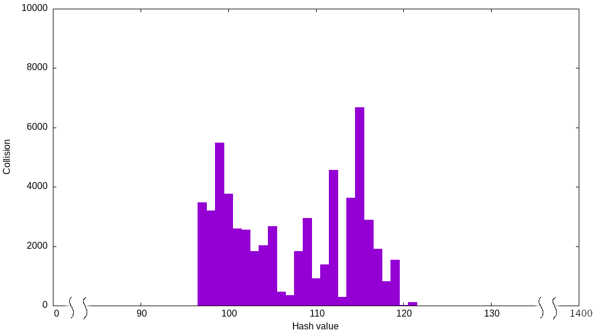
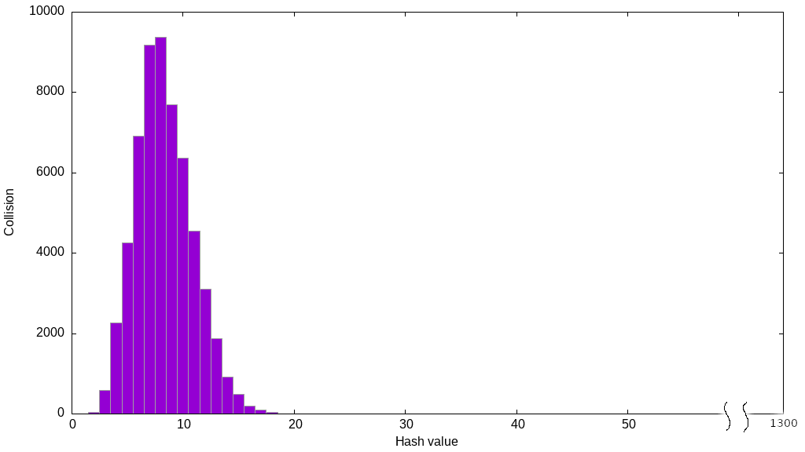
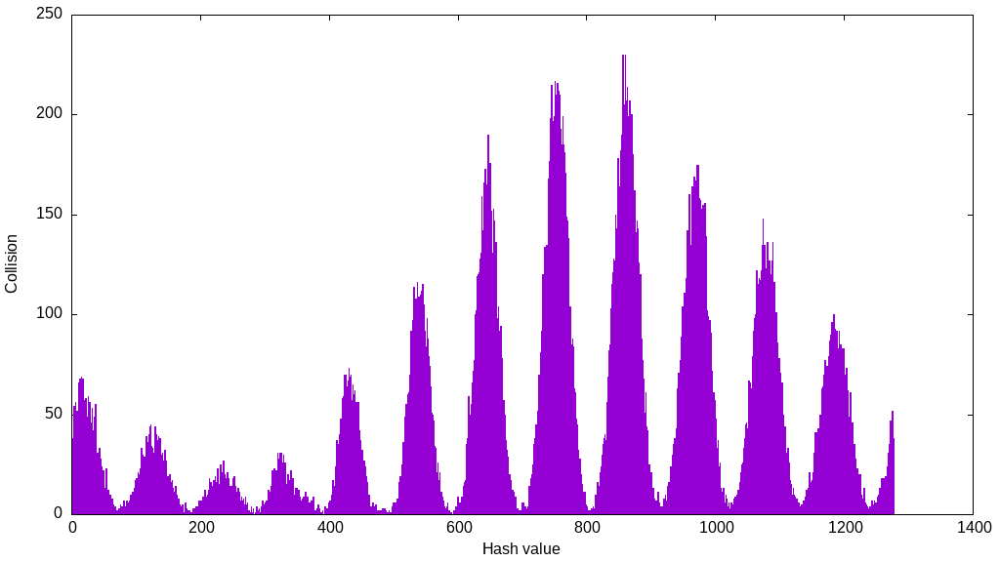
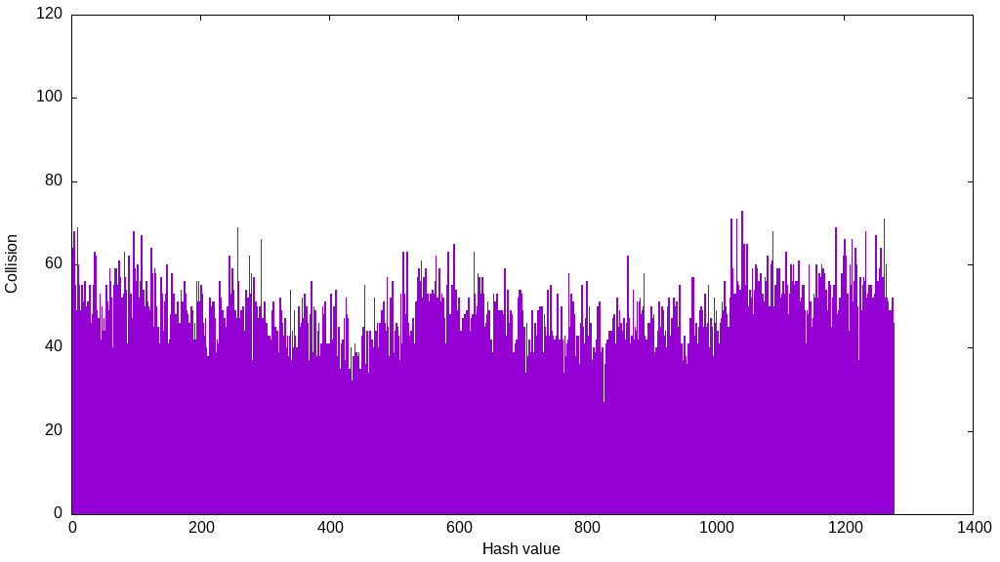
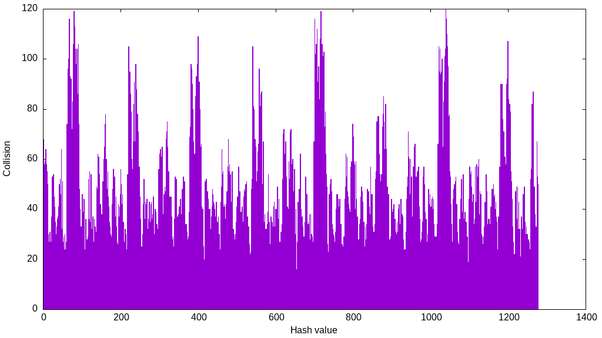
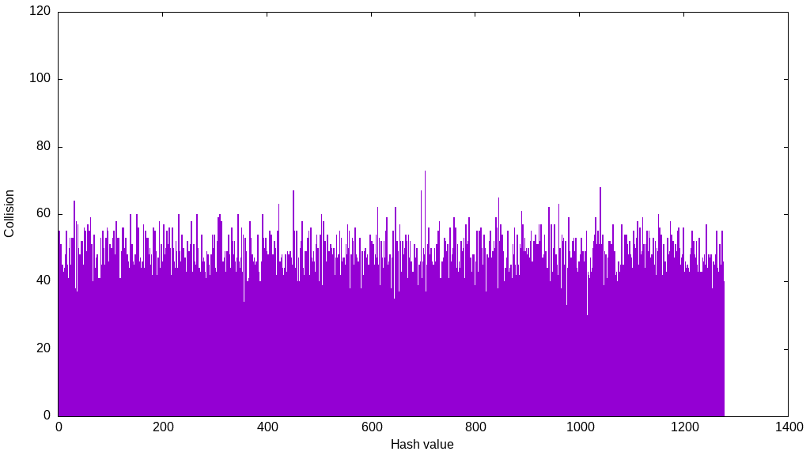
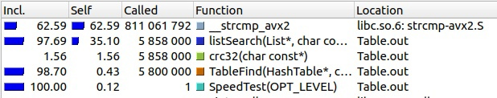
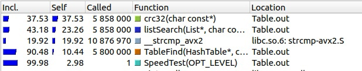

## Хеш таблица
# Введение
Данная работа нацелена на изучение методов оптимизаций программы на примере хеш-таблицы. В первой части работы проводится сравнение различных хеш-функций на распределение данных в таблице. Во второй части работы будут применены различные методы оптимизации для хеш-таблицы. Для этой части будет выбрана функция с наиболее равномерным распределением.
# Хеш таблица
**Хеш таблица** это структура данных, позволяющая хранить пары (ключ, значение) и выполнять три операции: операцию добавления новой пары, удаления и поиска пары по ключу. В рамках нашей задачи ключ и значение - одно и то же.
Существуют два основных варианта хеш-таблиц: с цепочками и открытой адресацией. В нашей задаче будет использоваться первый вариант, и цепочками будут выступать списки, заголовок каждого из которых лежит в ячейке таблицы с некоторым индексом. 
Функция, определяющая по ключу некоторое числовое значение - **хеш-функция**. Добавление элемента в таблицу - добавление его в соответствующий список, который находится в ячейке таблице с индексом, равным значению хеш-функции на этом элементе.
У различных элементов могут быть одинаковые **хеши** - значения хеш-функции. Тогда они попадут в один список (собственно, именно для этого нам список и нужен). Это явление называется **коллизией**.

# Часть 1. Сравнение хеш-функций
--------------------------------------------------------
Для тестирования функций был взят файл из 58000 английских слов. Размер хеш таблицы был равен 1277. Тестировались следующие функции:
1. **AlwaysOne** - всегда возвращает один.
2. **FirstChar** - возвращает ASCII код первого символа слова.
3. **LenHash** - возвращает длину слова.
4. **SumChar** - возвращает сумму ASCII кодов всех символов слова.
5. **RolHash** - хеш циклически сдвигается влево и применяется операция xor с символом слова
6. **RorHash** - то же, что и RolHash, только сдвиг вправо
7. **Crc32** - контрольная сумма

Результаты тестирования представлены в виде столбчатой диаграммы, где по горизонтальной оси - значение хеша, а по вертикальной - длина соответствующего списка.
---------------------------------------------------
1. **AlwaysOne**

| Максимальный размер списка | 58000 |
|:--------------------------:|:-----:|
| Минимальный размер списка  |   0   |
| Дисперсия                  |$$2.6343\cdot 10^6$$|

При использовании данной хеш-функции поиск по таблице будет линейным, так как все элементы будут помещены в один список. Данная функция была взята в качестве плохого примера, и её результат было несложно предсказать.

---------------------------------------------------
2. **FirstChar**

| Максимальный размер списка | 6670  |
|:--------------------------:|:-----:|
| Минимальный размер списка  |   0   |
| Дисперсия                  |157408 |

---------------------------------------------------
3. **LenHash**

| Максимальный размер списка | 9382  |
|:--------------------------:|:-----:|
| Минимальный размер списка  |   0   |
| Дисперсия                  |294596 |

Слова в исходном файле были взяты существующие и, соответственно, их длина не может быть очень большим числом. Соответственно, значения этой функции также не могут быть достаточно большими для нормального применения этой функции в таблице с большим количеством ячеек.

---------------------------------------------------
4. **SumChar**

| Максимальный размер списка | 230   |
|:--------------------------:|:-----:|
| Минимальный размер списка  |   0   |
| Дисперсия                  |2691   |

Данная функция ведёт себя немного лучше, чем все предыдущие, так как множество её значений больше. Однако оно всё ещё остаётся сильно ограниченным ввиду длины слов и ограниченности возможного значение ASCII кода символа. Также видны большие скачки значений размеров списков, что также говорит о неравномерном распределении даже в своёй области значений.

---------------------------------------------------
5. **RolHash**

| Максимальный размер списка | 73    |
|:--------------------------:|:-----:|
| Минимальный размер списка  |   24  |
| Дисперсия                  |65     |

Эта функция ведёт себя заметно лучше предыдущих. Видна некоторая неравномерность распределения, но всё же длина списков уже не такая большая (учитывая размер таблицы и количество элементов в ней).

---------------------------------------------------
6. **RorHash**

| Максимальный размер списка | 122   |
|:--------------------------:|:-----:|
| Минимальный размер списка  |   13  |
| Дисперсия                  |428    |

Данная функция, как и предыдущая, не оставила пустых списков в таблице, однако у неё видны большие скачки размеров списков, что говорит о долгом поиске элемента, хеш которого соответствует этому списку.

---------------------------------------------------
7. **Crc32**

| Максимальный размер списка | 73    |
|:--------------------------:|:-----:|
| Минимальный размер списка  |   25  |
| Дисперсия                  |45     |

Пожалуй, самая лучшая функция из всех представленых. Её график похож на график распределения функции RolHash, однако он более равномерный, так как не видно таких перепадов, как в RolHash.

------------------------------------------------------------------------
В заключении можно сказать, что не любая функция даёт равномерное распределение. Правильный выбор хеш-функции - важный шаг к скорости работы программы, ведь от распределения зависит максимальная длина списков и, соответственно, скорость поиска по данной структуре данных.

## Часть 2. Оптимизация
-----------------------------------------------------------------
Для оптимизации хеш-таблицы была написана функция, заполняющая таблицу и вызывающая поиск каждого слова таблицы 100 раз. В качестве профайлера использовалас утилита `vallgrind`.

Тест проводился на ноутбуке с процессором Intel(R) Core(TM) i5-11400H CPU @ 2.70GHz. Программа компилировалась с `-O1` уровнем оптимизации компилятора gcc и флагом `-mavx2` для возможности использования SIMD команд.

Результаты тестирования будем представлять в виде таблицы.

Для понимания влияния размера таблицы на скорость её работы проведём первый тест (уменьшённый размер таблицы) без оптимизаций и с размером таблицы, равным 211. Второй тест (базовый) проведём при размере таблицы 10601, также без дополнительных оптимизаций. Данная задача является учебной, соответственно, здесь делается упор именно на ассемблерные оптимизации. Для этого был выбран такой размер таблицы, что заполненность таблицы в среднем 5 элементов на список. 

|   |Версия программы            | Среднее время работы, мс|Коэффициент ускорения|
|:-:|:---------------------------|:-----------------------:|:-------------------:|
|0  |Уменьшённый размер таблицы  |      $$3400\pm200$$     |          1          |
|1  |Базовая                     |       $$460\pm20$$      |      $$7\pm1$$      |

На рисунках 1, 2 показаны разультаты профилирования. Видно, что в первом тесте большую часть времени происходило сравнение строк. Это вполне ожидаемый результат, ведь длина наших списков была большой из-за маленького размера таблицы. 

|                                                 |
|:----------------------------------------------------------------------------------:|
| Рисунок 1. Профилирование программы с уменьшённым размером хеш-таблицы (Версия 0). |

|                 |
|:--------------------------------------------------:|
| Рисунок 3. Профилирование базовой версии программы.|

Профилирование во втором тесте показывает, что большую часть времени работы программы занимала наша хеш-функция. Будем оптимизировать в первую очередь её. Так как существует ассемблерная команда `crc32`, применим здесь ассемблерные оптимизации. Сравним два варианта такой оптимизации. В первом напишем функцию полностью на ассемблере, а во втором воспользуемся ассемблерной вставкой.

Рузельтаты  тестов представлены в таблице

|   |Версия программы               | Среднее время работы, мс|Коэффициент абсолютного ускорения|Коэффициент относителього ускорения|
|:-:|:-----------------------------:|:-----------------------:|:-------------------------------:|:---------------------------------:|
| 1 |Базовая версия                 |    $$460\pm20$$         |                1                |                N/A                |
| 2 |Crc32 на ассемблере            |    $$357\pm7$$          |         $$1.3\pm0.1$$           |           $$1.3\pm0.1$$           |
| 3 |Ассемблерная вставка в `Crc32` |    $$300\pm10$$         |         $$1.5\pm0.1$$           |           $$1.2\pm0.1$$           |

|                                             |
|:------------------------------------------------------------------------------:|
| Рисунок 3. Профилирование программы с ассемблерной вставкой в Crc32 (Версия 3).|

Теперь профилирование показывает, что сравнение строк занимает большую часть времени оптимизированной программы. Добавив разумное условие на длину слов, можем применить SIMD инструкции. Ограничим длину слов 32 символами и будем класть в таблицу слова по выровненным адресам. Теперь можем загружать строки в YMM регистры и проводить более быстрое сравнение.
Для загрузки используем функцию `_mm256_load_si256`, для сравнения и получения маски - `_mm256_movemask_epi8` `_mm256_cmpeq_epi8`. Посмотрим на результаты

|   |Версия программы                        | Среднее время работы, мс|Коэффициент абсолютного ускорения|Коэффициент относителього ускорения|
|:-:|:--------------------------------------:|:-----------------------:|:-------------------------------:|:-----------------------------:|
| 1 |Базовая                                 |    $$460\pm20$$         |              1                  |             N/A               |
| 2 |`Crc32` на ассемблере                   |    $$357\pm7$$          |        $$1.3\pm0.1$$            |        $$1.3\pm0.1$$          |
| 3 |Ассемблерная вставка в `Crc32`          |    $$300\pm10$$         |        $$1.5\pm0.1$$            |        $$1.2\pm0.1$$          |
| 4 |strcmp с использованием SIMD инструкций |    $$268\pm5$$          |        $$1.7\pm0.1$$            |        $$1.1\pm0.1$$          |

## Выводы
-------------------------------------------------------------------------------
Большую роль в производительности хеш-таблицы играет оптимальный выбор хеш-функции и размера таблицы. Компилятор не всегда способен оптимизировать программу максимально эффективно под данную задачу, так как должны гарантировать правильное поведение программы при разных условиях (даже тех, которые в рамках одной задачи недостижимы).

Ассемблерные оптимизации дают небольшую оптимизацию в данном случае, но позволяют достичь максимальной производительности. В нашем исследовании с помощью ассемблерных оптимизаций удалось ускорить программу в 1.7 раз. Ускорение практически в 2 раза иногда может играть решающую роль.

Использование SIMD делает программу менее переносимой, ведь накладываются строгие ограничения на входные данные. Однако этот метод показывает, что пожертвовав некоторым удобством пользования программой можно достичь повышения производительности.

